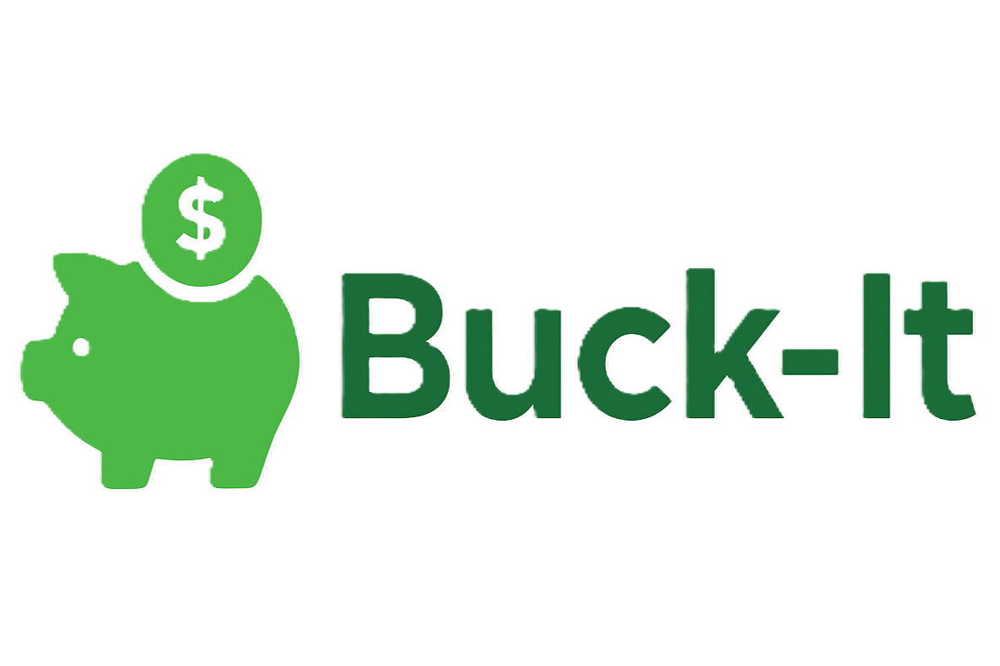

# Buck-It: Smart Personal Finance Dashboard 💸

A modern, AI-powered finance platform built with Next.js, Supabase, Tailwind, Prisma, Inngest, ArcJet, and Shadcn UI.



## Live Demo
[Website Link](https://buck-it-ai-powered-personal-finance.vercel.app/)

---

## Features
- 💡 **AI-powered insights** for smarter budgeting and spending and AI-powered 
- 📊 Beautiful dashboard with cards, pie charts, and transaction lists
- 🔒 Secure authentication with Clerk
- 🏦 Multi-account support with currency selection (₹, $, €, etc.)
- 🎨 Blue-Green gradient theme for a fresh, trustworthy look
- 🐷 Custom Buck-It logo and branding
- ⚡ Fast, modern UI with smooth animations and responsive design

---

## Run Locally:
1. **Clone the repo:**
   ```bash
   git clone https://github.com/yourusername/buck-it-finance.git
   cd buck-it-finance
   ```
2. **Install dependencies:**
   ```bash
   npm install
   ```
3. **Create a `.env` file and paste your API keys:**
   ```env
   DATABASE_URL=
   DIRECT_URL=
   NEXT_PUBLIC_CLERK_PUBLISHABLE_KEY=
   CLERK_SECRET_KEY=
   NEXT_PUBLIC_CLERK_SIGN_IN_URL=/sign-in
   NEXT_PUBLIC_CLERK_SIGN_UP_URL=/sign-up
   NEXT_PUBLIC_CLERK_AFTER_SIGN_IN_URL=/onboarding
   NEXT_PUBLIC_CLERK_AFTER_SIGN_UP_URL=/onboarding
   GEMINI_API_KEY=
   RESEND_API_KEY=
   ARCJET_KEY=
   ```
4. **Push Prisma schema:**
   ```bash
   npx prisma db push
   npx prisma generate
   ```
5. **Run the dev server:**
   ```bash
   npm run dev
   ```

---

## Screenshots


---

## Credits
- [Next.js](https://nextjs.org/)
- [Supabase](https://supabase.com/)
- [Tailwind CSS](https://tailwindcss.com/)
- [Prisma](https://www.prisma.io/)
- [Inngest](https://www.inngest.com/)
- [ArcJet](https://arcjet.com/)
- [Shadcn UI](https://ui.shadcn.com/)

---

## License
MIT
